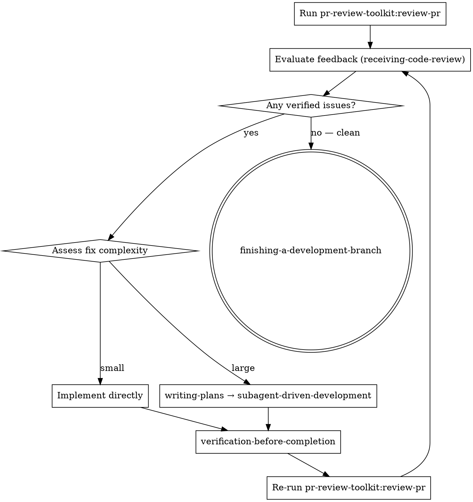

# PR Review Loop

## Overview

Automated review-fix-verify cycle. Runs `pr-review-toolkit:review-pr`, evaluates feedback, implements fixes, verifies, and re-reviews until clean.

**Core principle:** Review feedback is not done when fixes are implemented — it's done when re-review comes back clean.

## When to Use

- After `pr-review-toolkit:review-pr` produces a report
- When you need to act on PR review feedback end-to-end
- When review feedback needs implementation + verification + re-review

**Do not use when:**
- No PR review has been run yet (run `pr-review-toolkit:review-pr` first, or let this skill run it)
- Feedback is purely informational with no actionable fixes

## The Loop

## Step-by-Step

### 1. Run Review

**IMPORTANT:** `pr-review-toolkit:review-pr` is a **skill**, not a subagent. You MUST invoke it using `Skill("pr-review-toolkit:review-pr")`. Do NOT use the Task tool — it will fail with "agent type not found."

If a report was just produced, use that output directly — no copy-paste needed.

### 2. Evaluate Feedback

**REQUIRED SUB-SKILL:** Use superpowers:receiving-code-review

Evaluate the report following receiving-code-review rules:
- Verify each issue against the codebase
- Push back on incorrect suggestions
- Clarify anything unclear before implementing
- No performative agreement

### 3. Assess Fix Complexity

After evaluation, determine if fixes are **small** or **large** — assessed overall, not per-issue.

**Small:** Fixes are straightforward enough to implement directly without per-fix review gates.
- Typos, import fixes, simple renames
- Single-logic changes with obvious correctness
- Changes where verification-before-completion is sufficient quality gate

**Large:** Fixes are complex enough that each one benefits from its own spec review + code quality review cycle.
- Non-trivial logic changes across multiple areas
- Fixes that could introduce regressions
- Changes requiring careful architectural consideration
- Fixes where "did I implement this correctly?" is a real question

**When unsure, default to small.** The outer loop (re-review) catches anything missed. Only use the large path when fixes genuinely need per-task review gates.

### 4a. Small Path — Implement Directly

Implement fixes following receiving-code-review implementation order:
1. Blocking issues (breaks, security)
2. Simple fixes (typos, imports)
3. Complex fixes (refactoring, logic)
4. Test each fix individually

### 4b. Large Path — Structured Implementation

1. **REQUIRED SUB-SKILL:** Use superpowers:writing-plans to convert verified fixes into a plan file
2. **REQUIRED SUB-SKILL:** Use superpowers:subagent-driven-development to execute the plan
   - This provides per-task spec compliance review + code quality review
   - Sequential execution, fresh subagent per task

### 5. Verify

**REQUIRED SUB-SKILL:** Use superpowers:verification-before-completion

Confirm tests pass, nothing is broken. Do not skip this step. Do not claim fixes are done without running verification.

### 6. Re-Review

Re-run `pr-review-toolkit:review-pr` using `Skill("pr-review-toolkit:review-pr")`. This is NOT optional. You cannot exit the loop without a clean re-review.

**"Clean" means:** Re-review returns zero actionable findings. Not "I fixed what re-review found" — that's mid-loop, not exit.

**If re-review finds issues:** Fix them → verify → re-review AGAIN. This applies recursively. Fixing re-review findings is just another loop iteration, not a special case.

- If issues remain → back to Step 2
- If clean (zero actionable findings) → Step 7

### 7. Exit

**REQUIRED SUB-SKILL:** Use superpowers:finishing-a-development-branch

Review is clean. Complete the development branch.

## Red Flags — You Are Breaking the Loop

- "I've implemented the fixes" without running verification → **STOP.** Run verification-before-completion.
- "Fixes are done" without re-running review → **STOP.** Re-run pr-review-toolkit:review-pr.
- Skipping re-review because "I'm confident the fixes are correct" → **STOP.** Confidence is not verification.
- Treating implementation as the final step → **STOP.** Implementation is mid-loop, not end-of-loop.
- Copy-pasting review output manually → **STOP.** The skill automates this. Use the review output directly.
- "Re-review found issues, I fixed them, verification passes — done" → **STOP.** Fixing re-review findings requires ANOTHER re-review. Exit = zero findings, not zero unfixed findings.
- "The fix was trivial (typo/duplicate removal), no need to re-review" → **STOP.** The loop has no trivial-fix bypass. Every fix gets re-reviewed.
- Calling `Task(pr-review-toolkit:code-reviewer)` or any review subagent directly → **STOP.** Always use `Skill("pr-review-toolkit:review-pr")` — it decides which agents to dispatch based on what changed.

## Common Mistakes

| Mistake | Fix |
|---------|-----|
| Implement and declare done | Verify then re-review — always |
| Skip re-review after fixes | Re-review is mandatory, not optional |
| Use large path for simple typos | Default to small; large is for complex logic |
| Use small path for risky changes | If "did I do this right?" is a real question, use large path |
| Skip verification-before-completion | Never — this confirms tests actually pass |
| Run only one pass of the loop | Loop until re-review is clean |
| Implement before evaluating all feedback | Evaluate ALL items first (receiving-code-review rules) |
| Use Task tool for pr-review-toolkit:review-pr | It's a Skill, not a subagent — use Skill tool |
| Fix re-review findings and exit without re-reviewing | Fixing re-review findings = another loop iteration. Re-review again. |
| Skip re-review for "trivial" fixes | Every fix goes through the loop. No trivial bypass exists. |
| Call review subagents directly via Task tool | Always go through `Skill("pr-review-toolkit:review-pr")` — it handles agent selection based on changed files |
