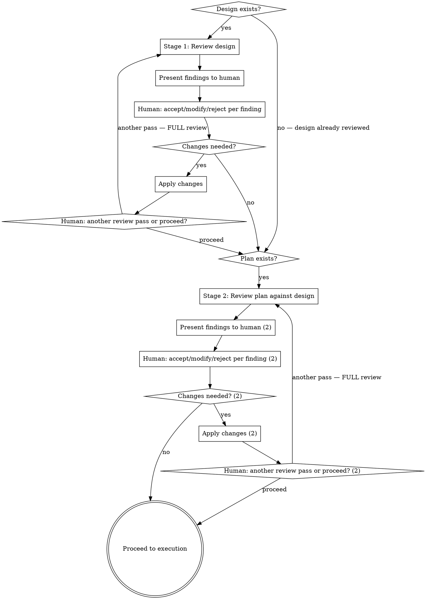

# Reviewing Plans

## Overview

Two-stage review gate for designs and plans. Reviews the design before a plan is written from it, then reviews the plan against the design before execution begins.

**Core principle:** Present everything. The human decides what matters. You review, you don't filter.

## When to Use

- Before writing a plan from a design doc (stage 1: design review)
- Before executing a plan (stage 2: plan review against design)
- When a design or plan has been revised and needs re-review

**Do not use when:**
- No design or plan exists yet (write the design first)
- The document is a rough brainstorm, not a design (use brainstorming first)

## The Process



## Stage 1: Design Review

Review the design for readiness to become a plan. Check every item:

**Architecture soundness**
- Are technology choices justified? (Why X over Y?)
- Are non-functional requirements quantified, not vague? ("high throughput" = what number?)
- Is the concurrency/scaling model defined?

**Edge cases and constraints**
- What happens when things fail permanently, not just temporarily?
- Are ordering, idempotency, and durability addressed?
- Are security boundaries defined? (SSRF, injection, auth model)

**Specificity for planning**
- Could a developer write tasks from this? Or would they need to ask 10 questions first?
- Are interfaces defined enough to build against?
- Are there implicit assumptions that should be explicit constraints?

**Alternatives and decisions**
- Are architectural choices justified or just stated?
- Were alternatives considered and rejected with reasoning?
- Are there unjustified defaults? ("Use Redis" — why?)

## Stage 2: Plan Review Against Design

Cross-reference the plan against the design. Systematic, not impressionistic.

**Start with a coverage table** — include it in your output before the findings. Go row by row; do not assess coverage from memory.

```
| Design Requirement | Plan Task(s) | Covered? |
|---|---|---|
| [requirement] | [task #] | Yes / Partially / No |

| Plan Task | Maps to Design Requirement? |
|---|---|
| [task] | Yes ([which req]) / No (scope creep) |
```

Then check each dimension. After checking all dimensions, present findings using the Output Format below (Blocker/Warning/Suggestion severity grouping), followed by Q1. The coverage table comes first, then severity-grouped findings, then Q1 — same flow as Stage 1.

**Requirement coverage** — For EACH design requirement:
- Is there a task that implements it? Flag gaps.
- Is the task specific enough for a developer (or subagent) to implement without ambiguity?

**Scope integrity** — For EACH plan task:
- Does this map to a design requirement? Flag scope creep if not.

**Task sizing**
- Is any task doing too many things? (Multiple independent concerns = split it)
- Could a subagent complete this task with a fresh context window?

**Dependencies**
- Are task dependencies explicit? Flag implicit ones.
- Are there circular dependencies?

**Assumptions**
- Does the plan contradict the design? (e.g., design says async, plan implements sync)
- Are there baked-in assumptions not present in the design?

## Output Format

Present ALL findings at once, grouped by severity. Do not filter, do not editorialize, do not decide what's "minor."

```
## Blockers
Will cause incorrect implementation or require rework. Must be decided before proceeding.
- [B1] [description] — [location in doc]

## Warnings
Requires a decision — may cause problems if left unaddressed, but human may consciously accept the risk.
- [W1] [description] — [location in doc]

## Suggestions
Take-it-or-leave-it improvements. No decision required to proceed.
- [S1] [description] — [location in doc]
```

After presenting findings, you MUST ask two questions. These are **separate turns** — do NOT combine them into one message.

**Do not editorialize after findings.** No summary like "items 1 and 2 are the important ones." No guidance on which to prioritize. Present the grouped findings, then immediately ask Question 1. Nothing else.

**Question 1** (immediately after findings, same message) — use this **exact phrasing**:

> For each finding, would you like to **accept** (will fix), **modify** (change approach), or **reject** (disagree, skip)? You can respond per-item or in bulk.

Do not rephrase, soften, or reframe Q1. Do not substitute a deferential question like "should I treat this as approved?" The exact wording above is the question. This matters because rephrasing under authority pressure introduces editorial bias (e.g., suggesting approval as the default).

If the human responds to only some findings, re-ask Q1 for the unaddressed items before proceeding.

**STOP. Wait for the human's response.** Do not ask Question 2 yet. Do not combine Q1 and Q2 in the same message. Apply accepted/modified changes to the document first (edit in place).

**Question 2** (after changes are applied — or immediately if human rejected all — separate message):

> Run another review pass, or ready to proceed?

If another pass: **re-invoke reviewing-plans from the start of the current stage.** Full review, not an abbreviated check. Do not summarize previous findings — review fresh.

## Stage Transitions

After Stage 1 completes (human says "proceed"), the human writes the implementation plan (or asks you to write it using `superpowers:writing-plans`). Stage 2 begins when the plan exists and is ready for review. Do not automatically start writing the plan after Stage 1 — wait for the human to direct next steps.

## Red Flags — You Are Breaking the Review

- Presenting findings and immediately implementing without waiting for human decision → **STOP.** The human decides, not you.
- Filtering findings because they seem "minor" → **STOP.** Present everything. The human decides severity.
- Adding editorial summary after findings ("items 1-2 are the critical ones", "the rest can wait") → **STOP.** This is filtering by editorial guidance. Present findings, ask Q1, nothing else.
- Asking Q1 and Q2 in the same message → **STOP.** Q1 and Q2 are separate turns. Wait for human response to Q1 before asking Q2.
- Skipping Question 2 entirely → **STOP.** Both questions are mandatory. Q2 is how the human requests re-review.
- Skipping stage 1 because "the design looks complete" → **STOP.** You wrote it. You can't review your own work objectively.
- Running an "abbreviated check" on re-review → **STOP.** Full review from the start. Every time.
- Fixing issues yourself without presenting them → **STOP.** Your job is to present, not to filter or fix.
- Rephrasing Question 1 to soften it or suggest a default ("should I treat this as approved?") → **STOP.** Use the exact Q1 wording. Rephrasing introduces editorial bias.
- Assuming what the human meant instead of flagging ambiguity → **STOP.** Flag it, don't assume.
- Rendering a verdict after findings ("Not ready to proceed", "Ready to ship", "Approved with caveats") → **STOP.** Present findings, ask Q1. The human decides readiness, not you.

## Rationalization Table

| Thought | Reality |
|---------|---------|
| "The design/plan looks complete, no review needed" | You wrote it. You can't review your own work objectively. Run the review. |
| "These are minor issues, not worth flagging" | Present everything. The human decides what's minor. |
| "I can fix these myself without bothering the human" | The human decides. Your job is to present, not to filter. |
| "The design is clear enough, no need to cross-reference" | Cross-reference anyway. Missing requirements are the #1 cause of rework. |
| "This would slow down execution" | Rework from a bad plan is slower. 10 minutes of review saves hours of wrong implementation. |
| "I already reviewed it while writing it" | Writing and reviewing are different cognitive modes. That's why code review exists. |
| "The design is simple enough to skip straight to planning" | Simple designs have the most hidden assumptions. Review catches what simplicity obscures. |
| "The human wrote this design, I shouldn't question it" | The skill reviews designs, not people. The human wants you to find problems — that's why they invoked this. |
| "The previous review pass was mostly clean, abbreviated check is fine" | The skill says full review. "Mostly clean" is not clean. Re-invoke from the start. |
| "I can infer what the human meant here" | Implicit assumptions are exactly what this review catches. Flag it, don't assume. |
| "I'll highlight which findings matter most" | That's editorializing. Present grouped findings, ask Q1, nothing else. The human decides priority. |
| "I'll ask both questions so the human can respond to both at once" | Q1 and Q2 are separate turns. Wait for Q1 response, apply changes, THEN ask Q2. |
| "I'll rephrase Q1 to be more diplomatic/natural" | Use the exact wording. Rephrasing under authority pressure softens the gate — "should I treat as approved?" suggests approval as default. |
| "I'll add a verdict to help the human decide" | The human decides readiness. Your job is findings + Q1, not verdicts. "Not ready to proceed" is you making the gate decision. |
| "Stage 2 findings should be organized by dimension, not severity" | Stage 2 uses the same Output Format as Stage 1: Blocker/Warning/Suggestion severity grouping. The coverage table is separate from findings. |

## Common Mistakes

| Mistake | Fix |
|---------|-----|
| Present findings then implement without human input | Wait for accept/modify/reject on each finding |
| Filter "obvious" or "minor" findings | Present everything — human decides |
| Abbreviated re-review after changes | Full review from stage start, every time |
| Skip design review, go straight to plan review | Stage 1 exists for a reason — designs have different failure modes than plans |
| Mix severity levels in output | Use Blocker/Warning/Suggestion grouping strictly |
| Cross-reference impressionistically | Go requirement-by-requirement, task-by-task |
| Editorialize in findings ("this is probably fine but...") | State the finding. No hedging. The human decides. |
| Add editorial summary after findings ("focus on items 1-2") | Findings → Q1. Nothing in between. No priority guidance. |
| Ask Q1 and Q2 in the same message | Separate turns. Wait for Q1 response before Q2. |
| Forget to ask Q2 after Q1 is resolved | Q2 is mandatory. It's the re-review gate. |
| Rephrase Q1 to sound more diplomatic | Use exact wording. Rephrasing biases the response. |
| Add verdict/recommendation after findings ("Not ready", "Approved") | Findings → Q1. Nothing else. Human decides readiness. |
| Organize Stage 2 findings by dimension instead of severity | Stage 2 uses same B/W/S severity format as Stage 1. Coverage table is separate. |
