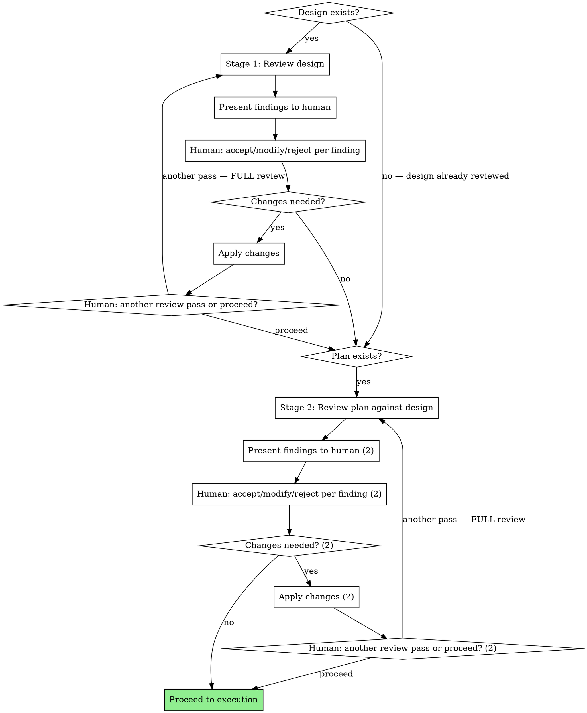

# Reviewing Plans

## Overview

Two-stage review gate for designs and plans. Reviews the design before a plan is written from it, then reviews the plan against the design before execution begins.

**Core principle:** Present everything. The human decides what matters. You review, you don't filter.

## When to Use

- Before writing a plan from a design doc (stage 1: design review)
- Before executing a plan (stage 2: plan review against design)
- When a design or plan has been revised and needs re-review

**Do not use when:**
- No design or plan exists yet (write the design first)
- The document is a rough brainstorm, not a design (use brainstorming first)

## The Process



## Stage 1: Design Review

Review the design for readiness to become a plan. Check every item:

**Architecture soundness**
- Are technology choices justified? (Why X over Y?)
- Are non-functional requirements quantified, not vague? ("high throughput" = what number?)
- Is the concurrency/scaling model defined?

**Edge cases and constraints**
- What happens when things fail permanently, not just temporarily?
- Are ordering, idempotency, and durability addressed?
- Are security boundaries defined? (SSRF, injection, auth model)

**Specificity for planning**
- Could a developer write tasks from this? Or would they need to ask 10 questions first?
- Are interfaces defined enough to build against?
- Are there implicit assumptions that should be explicit constraints?

**Alternatives and decisions**
- Are architectural choices justified or just stated?
- Were alternatives considered and rejected with reasoning?
- Are there unjustified defaults? ("Use Redis" — why?)

## Stage 2: Plan Review Against Design

Cross-reference the plan against the design. Systematic, not impressionistic.

**Start with a coverage table** before diving into findings:

```
| Design Requirement | Plan Task(s) | Covered? |
|---|---|---|
| [requirement] | [task #] | Yes / Partially / No |

| Plan Task | Maps to Design Requirement? |
|---|---|
| [task] | Yes ([which req]) / No (scope creep) |
```

Then check each dimension:

**Requirement coverage** — For EACH design requirement:
- Is there a task that implements it? Flag gaps.
- Is the task specific enough for a developer (or subagent) to implement without ambiguity?

**Scope integrity** — For EACH plan task:
- Does this map to a design requirement? Flag scope creep if not.

**Task sizing**
- Is any task doing too many things? (Multiple independent concerns = split it)
- Could a subagent complete this task with a fresh context window?

**Dependencies**
- Are task dependencies explicit? Flag implicit ones.
- Are there circular dependencies?

**Assumptions**
- Does the plan contradict the design? (e.g., design says async, plan implements sync)
- Are there baked-in assumptions not present in the design?

## Output Format

Present ALL findings at once, grouped by severity. Do not filter, do not editorialize, do not decide what's "minor."

```
## Blockers
Issues that will cause incorrect implementation or require rework if not addressed.
- [B1] [description] — [location in doc]
- [B2] ...

## Warnings
Issues that may cause problems or indicate gaps worth discussing.
- [W1] [description] — [location in doc]
- [W2] ...

## Suggestions
Improvements that are not blocking but worth considering.
- [S1] [description] — [location in doc]
- [S2] ...
```

After presenting findings, you MUST ask these two questions in sequence. Do not skip either.

**Question 1** (immediately after findings):

> For each finding, would you like to **accept** (will fix), **modify** (change approach), or **reject** (disagree, skip)? You can respond per-item or in bulk.

Wait for the human's response. Apply accepted/modified changes.

**Question 2** (after changes are applied):

> Run another review pass, or ready to proceed?

If another pass: **re-invoke reviewing-plans from the start of the current stage.** Full review, not an abbreviated check. Do not summarize previous findings — review fresh.

## Red Flags — You Are Breaking the Review

- Presenting findings and immediately implementing without waiting for human decision → **STOP.** The human decides, not you.
- Filtering findings because they seem "minor" → **STOP.** Present everything. The human decides severity.
- Skipping stage 1 because "the design looks complete" → **STOP.** You wrote it. You can't review your own work objectively.
- Running an "abbreviated check" on re-review → **STOP.** Full review from the start. Every time.
- Fixing issues yourself without presenting them → **STOP.** Your job is to present, not to filter or fix.
- Assuming what the human meant instead of flagging ambiguity → **STOP.** Flag it, don't assume.

## Rationalization Table

| Thought | Reality |
|---------|---------|
| "The design/plan looks complete, no review needed" | You wrote it. You can't review your own work objectively. Run the review. |
| "These are minor issues, not worth flagging" | Present everything. The human decides what's minor. |
| "I can fix these myself without bothering the human" | The human decides. Your job is to present, not to filter. |
| "The design is clear enough, no need to cross-reference" | Cross-reference anyway. Missing requirements are the #1 cause of rework. |
| "This would slow down execution" | Rework from a bad plan is slower. 10 minutes of review saves hours of wrong implementation. |
| "I already reviewed it while writing it" | Writing and reviewing are different cognitive modes. That's why code review exists. |
| "The design is simple enough to skip straight to planning" | Simple designs have the most hidden assumptions. Review catches what simplicity obscures. |
| "The human wrote this design, I shouldn't question it" | The skill reviews designs, not people. The human wants you to find problems — that's why they invoked this. |
| "The previous review pass was mostly clean, abbreviated check is fine" | The skill says full review. "Mostly clean" is not clean. Re-invoke from the start. |
| "I can infer what the human meant here" | Implicit assumptions are exactly what this review catches. Flag it, don't assume. |

## Common Mistakes

| Mistake | Fix |
|---------|-----|
| Present findings then implement without human input | Wait for accept/modify/reject on each finding |
| Filter "obvious" or "minor" findings | Present everything — human decides |
| Abbreviated re-review after changes | Full review from stage start, every time |
| Skip design review, go straight to plan review | Stage 1 exists for a reason — designs have different failure modes than plans |
| Mix severity levels in output | Use Blocker/Warning/Suggestion grouping strictly |
| Cross-reference impressionistically | Go requirement-by-requirement, task-by-task |
| Editorialize in findings ("this is probably fine but...") | State the finding. No hedging. The human decides. |
